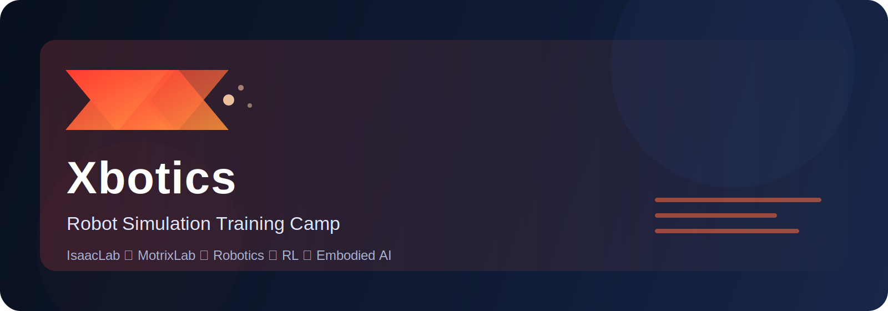

  

  <h1>谋先飞机器人仿真实训</h1>

  
面向机器人学、强化学习与具身智能爱好者的开源训练营，帮助你从理论基础走到 MotrixLab 的真实仿真实战。

  

    
    
    
  

  

    <a href="#快速开始">快速开始</a> ·
    <a href="#学习路线">学习路线</a> ·
    <a href="#结营作业归档">结营作业</a> ·
    <a href="#社区共建">社区共建</a>
  

---

## 封面横幅

  

> [!NOTE]
> 这是训练营的文档与宣传仓库，适合第一次了解项目的同学快速查看课程路线、结营作业与官方文档入口。

## 项目数字指标

<table>
  <tr>
    <td align="center" width="25%">
      <strong>2 个月</strong> 
      系统训练周期
    </td>
    <td align="center" width="25%">
      <strong>2 大阶段</strong> 
      理论基础 / 仿真实操
    </td>
    <td align="center" width="25%">
      <strong>1 个平台</strong> 
      MotrixLab
    </td>
    <td align="center" width="25%">
      <strong>1 条主线</strong> 
      四足机器人任务迁移
    </td>
  </tr>
</table>

## 项目亮点

  

    
理论 + 实操闭环

    
从坐标系变换、轨迹规划，到深度强化学习与仿真任务迁移。

  

  

    
双平台实战

    
聚焦 MotrixLab，覆盖环境配置、任务复现与工程迁移。

  

  

    
面向社区共建

    
欢迎通过 Issue / PR 持续完善文档、案例与教学内容。

  

  

    
真实任务导向

    
以四足机器人导航与行走任务为主线，强调可落地、可复现。

  

## 主页分栏导航

<table>
  <tr>
    <td valign="top" width="50%">

### 📖 快速开始

1. 先看官方平台教程，了解基础框架：
   - [MotrixLab 基础框架教程](https://motrixlab.readthedocs.io/zh-cn/latest/user_guide/tutorial/basic_frame.html)
2. 再进入 GitHub 仓库查看源码与文档结构：
   - [项目仓库](https://github.com/Xbotics-Embodied-AI-club/Motphys-Xbotics-Robot-Rl-Sim-Training-Camp)
3. 从第一期训练营开始阅读：
   - [第一期总览](./docs/第一期/index.md)
4. 最后查看结营作业：
   - [结营作业总览](./docs/结营作业/index.md)

    </td>
    <td valign="top" width="50%">

### 🧭 学习路径

| 阶段 | 核心目标 | 包含内容简介 | 详细指引 |
| :--- | :--- | :--- | :---: |
| **第一个月：理论基础** | 构建机器人学与强化学习底层认知 | 坐标系与位姿变换、轨迹规划、机器人运动学 (FK/IK)、深度强化学习 (PPO/A3C) | [👉 查看详情](./docs/第一期/month1/index.md) |
| **第二个月：仿真实操** | 物理引擎实操与任务代码迁移 | 熟悉 MotrixLab / MotrixLab、拆解 `Navigation-Flat-Anymal-C-v0` 任务、资产下载与配置类迁移 | [👉 查看详情](./docs/第一期/month2/index.md) |

    </td>
  </tr>
</table>

## 适合谁

- 想系统学习机器人学与强化学习的同学
- 想接触 IsaacLab / MotrixLab 仿真的学习者
- 想了解四足机器人导航任务迁移的工程实践者
- 想参与社区共建、一起完善训练营资料的贡献者

## 你能学到什么

- 坐标系变换与位姿表达
- 轨迹规划基础
- 机器人正逆运动学
- 深度强化学习入门与实战
- 仿真平台环境配置与任务迁移
- 四足机器人导航任务的工程落地

## 结营作业归档

| 期数 | 学员 | 任务 | 代码 |
| :--- | :--- | :--- | :---: |
| **第一期** | 张恒 | Unitree Go2 平地行走任务迁移（`Isaac-Velocity-Flat-Unitree-Go2-v0` → MotrixLab） | [👉 查看代码](./docs/结营作业/第一期/张恒/index.md) |

## 社区共建

欢迎通过以下方式参与社区建设：

- 提交 Issue 反馈问题或建议
- 提交 Pull Request 完善文档、案例或排版
- 补充学习笔记、踩坑总结与实验结果
- 一起维护训练营的课程内容与教学体验

## 关注我们

如果你希望及时了解训练营更新，欢迎关注 Xbotics 具身智能实验室的官方动态。

## 许可证

本项目采用 [CC BY-NC-SA 4.0](https://creativecommons.org/licenses/by-nc-sa/4.0/) 进行许可。
